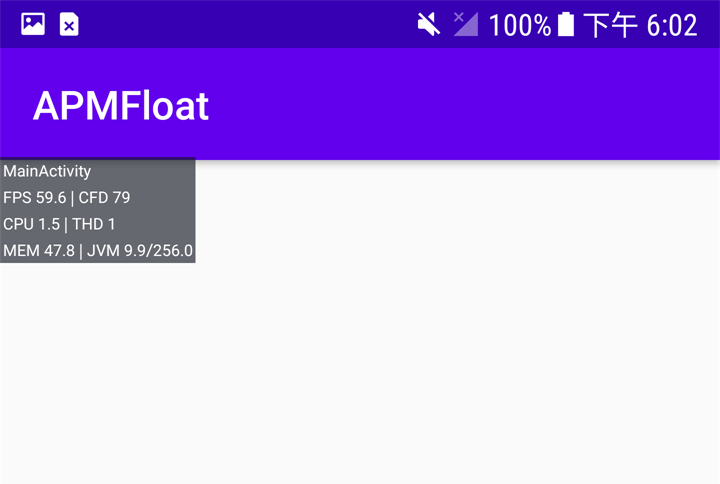

## 开发助手

辅助开发检查性能问题，快速找到视觉页面



悬浮窗依次展示数据为：

>当前Activity名称、
FPS、文件句柄数量、
CPU占用率、当前线程数量、
内存占用值、JVM内存使用情况

集成方式

**Step 1.** Add it in your root build.gradle at the end of repositories:

```css
	allprojects {
		repositories {
			...
			maven { url 'https://jitpack.io' }
		}
	}
```

**Step 2.** Add the dependency

```css
	dependencies {
	        implementation 'com.github.forJrking:ApmFloat:Tag'
	}
```

**Step 3.** initialize

```java
ApmOverlayController.initialize(context,isDebug)
```

